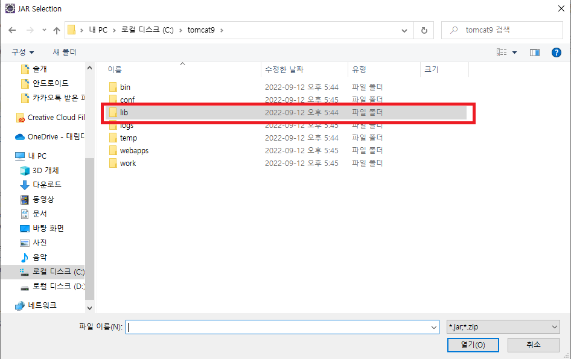

# gangmin
기본 환경설정 방법.
------------------
### 1. Git Repositories 복제하기

#### 1. 로컬 워크스페이스 생성

#### 2. Window > Show View > Other... 선택

#### 3. Git Repositories 선택

#### 4. Clone a Git repository 선택

#### 5. URI에 레포지토리 주소 입력

```
비밀번호 대신 토큰을 발급받아서 사용할 것
```
#### 6. Next >

#### 7. Finish

#### 8. import Project

#### 9. Projects from Git

#### 10. Existing local repository

#### 11. Select a Git Repository

#### 12. Import existing Eclipse projects

#### 13. Import Projects

#### 14. Import된 프로젝트를 Project Explorer 에서 확인

#### 15. Server 추가

#### 16. Tomcat v9.0 Server 선택

#### 17. Available에 있는 프로젝트를 Configured로 Add

#### 18. Build Path

#### 19. unbound로 표시되면 해당항목 Remove

#### 20. Add External JARs...

#### 21. Tomcat이 저장되있는 폴더의 lib

#### 22. servlet-api.jar 파일 선택

#### 23. Apply and Close


### 2. DataBase 설정
#### 1. DataBase 설치
	https://www.oracle.com/database/technologies/xe-prior-release-downloads.html
#### 2. DataBase 환경설정
	https://cmleo.tistory.com/19
### 2-1. sqldeveloper 설치
	https://www.oracle.com/database/sqldeveloper/technologies/download/
#### 3. Oracle 접속 후 TABEL 생성

```
CREATE TABLE MEMBER(
 mkey NUMBER(8) PRIMARY KEY,
 mid VARCHAR(45) UNIQUE NOT NULL,
 mpw VARCHAR(45) NOT NULL,
 mname VARCHAR(45) NOT NULL,
 mnickname VARCHAR(45) NOT NULL,
 mhp VARCHAR(45) NOT NULL,
 maddress VARCHAR(45),
 mmail VARCHAR(45),
 mtime date default sysdate,
 mbirthday VARCHAR(45),
 madmin NUMBER(1)
);
```
#### 4. SEQUENCE 생성
```
CREATE SEQUENCE tmp_seq START WITH 1 INCREMENT BY 1 MAXVALUE 100 CYCLE NOCACHE;
```
#### 5. Servers > Tomcat v9.0 > context.xml

#### 6. Source 탭 선택

#### 7. Source 탭 맨 밑쪽에 다음과 같은 코드 추가

```
    <Resource
        name="jdbc/oracle"
        auth="Container"
        type="javax.sql.DataSource"
        driverClassName="oracle.jdbc.driver.OracleDriver"
        url="jdbc:oracle:thin:@localhost:1521:XE"
        username="scott"
        password="tiger"
        maxActive="50"
        maxWait="-1"
     />
```
	username과 password는 환경설정때 자신이 사용했던 계정정보 입력
```
## DB QUERY문
### 1. Lecture Table
```
	CREATE TABLE LECTURE(
    lkey NUMBER(8) PRIMARY KEY,
    lid VARCHAR2(45) NOT NULL,
    lname VARCHAR2(45) NOT NULL,
    ltype VARCHAR2(45),
    lconst VARCHAR2(45),
    lsubject VARCHAR2(45),
    lunit VARCHAR2(45),
    luser VARCHAR2(45),
    lcreate VARCHAR2(45),
    llevel VARCHAR2(45),
    ltime NUMBER(8),
    lprice NUMBER(10),
    lduration NUMBER(8),
    linfo VARCHAR2(4000),
    ltarget VARCHAR2(100),
    limage VARCHAR2(255),
    lstartdate DATE,
    lsumgrade NUMBER(10),
    lcountgrade NUMBER(8),
    lacademy VARCHAR2(45)
);
```
### 2. Lecture SEQUENCE
```
	CREATE SEQUENCE lec_seq START WITH 1 INCREMENT BY 1 MAXVALUE 1000 CYCLE NOCACHE;
```
### 3. Lecture Table 기본 정보
```
INSERT INTO LECTURE(LKEY, LID, LNAME, LTYPE, LCONST, LSUBJECT, LUNIT, LUSER, LCREATE, LLEVEL
, LTIME,LPRICE, LDURATION, LINFO, LTARGET, LIMAGE, LSTARTDATE, LSUMGRADE, LCOUNTGRADE, LACADEMY)
 VALUES(LEC_SEQ.nextval, '한석원의 4의규칙', '한석원', '수능', '12강 / 완강', '수학','수학I','고3, N수'
 ,'스튜디오','문제풀이',48,100000,1
 ,'4의 규칙은 22, 30번 문항을 제외한 4점 문항을 집요하게 훈련하여
\n
어떤 문제라도 망설임 없이 교과서가 제시한 방법으로 풀어내게 하는 강좌입니다.
\n\n
SEASON 1 : 22,30번을 제외한 모든 4점 문항 대비
\n
일관된 방법으로 4점 문항을 훈련할 수 있는 입문 N제 강좌
\n\n
01 절차탁마
\n
위기의 순간에서도 쌓아온 수학적 개념들이 자유롭게, 그리고 즉각적으로 결합될 수 있도록 풀이를 반복하여 갈고 닦습니다.
\n
따라서 이 강좌는 이미 개념학습이 끝난 수험생을 위한 강좌입니다.
\n\n
02 보편타당
\n
특정 문제에 적용되는 방법, 다양한 풀이 방법을 제시하지 않습니다.
\n
어떠한 문제라도 교과 개념 상 ‘나의 풀이 방법이 자명하다’의 수준이 될 때까지 익히고 또 익힙니다.
\n\n
03 이무일유
\n
이 강의는 4점 난이도에 맞춰져 있습니다.
\n
4점 문항을 통해 익히는 자유롭고 즉각적인 개념 결합과정, 이 연습이야말로 22, 30번을 대비하는 확실한 방법입니다.
\n\n
★수강 방법★
\n\n
1. 예습: 먼저 문제를 풀고 채점합니다.
\n
① 틀린 문제는 최소한 3번까지 다시 풉니다.
\n
(이 과정에서 출제 의도를 파악하고 문제를 해결하는 능력이 배양됩니다.)
\n
② 3번 이상의 시도에도 풀리지 않는 문제에 대해서만 해설지를 참고합니다.
\n
③ 해설을 이해해보고, 한번 더 풀어봅니다.
\n\n
2. 평가: 내가 선택한 풀이 방법에 대해 3가지 항목으로 평가합니다.
\n
① 다른 문제에 대해서도 적용한 방법인가?
\n
② 수능 현장에서도 자유자재로 사용할 수 있는 방법인가?
\n
③ 위기의 순간(가령 시간의 부족)에도 흔들림 없이 선택할 수 있는 방법인가?
\n\n
3. 비교: 3가지 평가항목에 해당하지 않는 경우 강의를 통해 한석원 선생님과 비교합니다.'
,'4점 난이도를 훈련하고 싶은 수험생을 위한 강좌입니다.'
,'hsw.jpg','2018-03-01',0,0,'대성마이맥')
INSERT INTO LECTURE(LKEY, LID, LNAME, LTYPE, LCONST, LSUBJECT, LUNIT, LUSER, LCREATE, LLEVEL
, LTIME,LPRICE, LDURATION, LINFO, LTARGET, LIMAGE, LSTARTDATE, LSUMGRADE, LCOUNTGRADE, LACADEMY)
	VALUES(LEC_SEQ.nextval, '2023 현우진의 드릴 - 수학I(공통)', '현우진', '수능', '각 85분씩, 총 8강', '수학','수학I','고3, N수'
 ,'스튜디오','문제풀이',45,60000,1
 ,'수학l은 공통과목일 뿐만 아니라 수능에 직접 출제되는 첫 번째 과목으로 
\n
다루는 내용의 난이도는 어렵지 않지만, 많은 학생들이 쉽게 간과하는 과목입니다. 
\n
특히 수학l 과목은 단독 출제보다는 다른 과목과 연계되어 출제될 가능성이 높은 과목입니다. 
\n
따라서 더욱이 꼼꼼하고 탄탄하게 학습해야 할 필요가 있습니다.
\n
선배들로부터 극찬을 받은 검증된 문항으로 구성되어 있는 현우진의 드릴,
\n
킬러, 준킬러 문항에 대한 대비가 필요한 친구들에게 드릴 강좌를 꼭 추천합니다.
\n\n\n
1. 고난도, 신유형 대비 심화 문제풀이 학습을 통한 실전 훈련 가능
\n
드릴 강좌는 수능에 출제 가능한 모든 상황을 훈련하기 위해 제작된 
\n
고난도, 신유형 대비 심화 문제풀이 강좌입니다.
\n
드릴에서는 뉴런에서 학습했던 실전 개념을 한층 더 구체화시켜 
\n
심화 문제풀이에 적용할 수 있는 훈련을 진행합니다,
\n
따라서 드릴을 수강하기 전, 현우진 선생님의 뉴런, 수분감을 통해 
\n
개념과 기출 문제에 대한 학습을 전반적으로 진행한 후,
\n
과목에 대한 이해가 어느정도 갖추어져 있는 상태에서 수강할 것을 추천드립니다.
\n
드릴에서는 단원별로 중요하게 다루어지는 필수 주제뿐만 아니라 
\n
아직 출제되지 않았지만 출제될 가능성이 있는 미출제 요소들까지도 대비합니다.
\n\n\n
문항별 COMMENT는 문항에 대한 더욱 확실한 이해를 도와줍니다.
\n
드릴에 수록된 각 문제 옆에 있는 COMMENT에서는 
\n
문항과 관련된 핵심 개념과 비슷한 소재를 다루는 최근 기출 문항이 수록되어 있어, 
\n
이전 강좌에서 학습한 내용을 자연스럽게 적용해볼 수 있습니다. 
\n
이와 함께 현우진 선생님의 조언까지도 담겨 있기 때문에
\n
각 문항별 COMMENT는 드릴 강좌를 학습하는 데 중요한 부분이라고 할 수 있습니다. 
\n
COMMENT에는 문제 해결의 키, 주요 개념 등이 
\n
관련지어 알아두어야 할 중요한 내용이 모두 담겨 있으니 
\n
문제를 푼 뒤에 꼭 읽어보시기 바랍니다.
\n\n\n
2. 다양한 상황에 대비 가능하도록 설계된 드릴 교재 문항 구성
\n
최근 수능시험의 경향이 해볼 만한 킬러 문항과 
\n
다수의 까다로운 준킬러 문항을 출제하는 기조를 보이고 있어, 
\n
수학l에서도 어려운 문제를 풀어낼 수 있는 충분한 훈련을 할 필요가 있습니다. 
\n
드릴은 실전 훈련을 위해 정교하게 설계된 문항을 제공합니다.'
,'수능에서 고득점을 받고 싶은 수험생'
,'huj.jpg','2018-05-01',0,0,'메가스터디')
INSERT INTO LECTURE(LKEY, LID, LNAME, LTYPE, LCONST, LSUBJECT, LUNIT, LUSER, LCREATE, LLEVEL
, LTIME,LPRICE, LDURATION, LINFO, LTARGET, LIMAGE, LSTARTDATE, LSUMGRADE, LCOUNTGRADE, LACADEMY)
	VALUES(LEC_SEQ.nextval, '2023 현우진의 드릴 - 수학II(공통)', '현우진', '수능', '각 75분씩, 총 10강', '수학','수학II','고3, N수'
 ,'스튜디오','문제풀이',50,69000,1
 ,'공통과목 중에서도 킬러의 출제 가능성 및 중요도뿐만 아니라 난도 또한 높은 과목입니다. 
\n
최근 평가원 시험지는 ‘까다로운 준킬러 문항 + 해볼 만한 킬러 문항’으로 구성되고 있으며,
\n
이에 따라 준킬러, 킬러 문항에 대한 꼼꼼하고 탄탄한 대비를 할 수 있어야 합니다. 
\n
선배들로부터 극찬을 받은 검증된 문항으로 구성되어 있는 현우진의 드릴,
\n
킬러, 준킬러 문항에 대한 대비가 필요한 친구들에게 드릴 강좌를 꼭 추천합니다.
\n\n\n
1. 고난도, 신유형 대비 심화 문제풀이 학습을 통한 실전 훈련 가능
\n
드릴 강좌는 수능에 출제 가능한 모든 상황을 훈련하기 위해 제작된 
\n
고난도, 신유형 대비 심화 문제풀이 강좌입니다.
\n
드릴에서는 뉴런에서 학습했던 실전 개념을 한층 더 구체화시켜 
\n
심화 문제풀이에 적용할 수 있는 훈련을 진행합니다,
\n
따라서 드릴을 수강하기 전, 현우진 선생님의 뉴런, 수분감을 통해 
\n
개념과 기출 문제에 대한 학습을 전반적으로 진행한 후,
\n
과목에 대한 이해가 어느정도 갖추어져 있는 상태에서 수강할 것을 추천드립니다.
\n
드릴은 이미 학습했던 실전 개념들을 한층 더 구체화시켜 
\n
심화 문제 풀이에 적용할 수 있도록 훈련하는 강좌이기 때문입니다.
\n
드릴에서는 단원별로 중요하게 다루어지는 필수 주제뿐만 아니라 
\n
아직 출제되지 않았지만 출제될 가능성이 있는 미출제 요소들까지도 대비합니다.
\n
또한 현우진 선생님의 다채로운 해설 강의를 통해 
\n
다양한 유형과 상황에 대비할 수 있으며, 처음 보는 문제를 만났을 때도
\n
당황하지 않고 풀어낼 수 있는 단단한 실력까지 기를 수 있을 것입니다.
\n\n\n
문항별 COMMENT는 문항에 대한 더욱 확실한 이해를 도와줍니다.
\n
드릴에 수록된 각 문제 옆에 있는 COMMENT에서는 
\n
문항과 관련된 핵심 개념과 비슷한 소재를 다루는 최근 기출 문항이 수록되어 있어, 
\n
이전 강좌에서 학습한 내용을 자연스럽게 적용해볼 수 있습니다. 
\n
이와 함께 현우진 선생님의 조언까지도 담겨 있기 때문에
\n
각 문항별 COMMENT는 드릴 강좌를 학습하는 데 중요한 부분이라고 할 수 있습니다. 
\n
COMMENT에는 문제 해결의 키, 주요 개념 등이 
\n
관련지어 알아두어야 할 중요한 내용이 모두 담겨 있으니 
\n
문제를 푼 뒤에 꼭 읽어보시기 바랍니다.
\n\n\n
2. 다양한 상황에 대비 가능하도록 설계된 드릴 교재 문항 구성
\n
최근 수능시험의 경향이 해볼 만한 킬러 문항과 
\n
다수의 까다로운 준킬러 문항을 출제하는 기조를 보이고 있어, 
\n
어려운 문제를 풀어낼 수 있는 충분한 훈련을 할 필요가 있습니다. 
\n
드릴은 실전 훈련을 위해 정교하게 설계된 문항을 제공합니다.
\n
수학Ⅱ에서 출제될 수 있는 준킬러, 킬러 문항들을 단원별로 배치하였고 
\n
각 단원의 특성을 살린 고퀄리티의 문항으로 문제풀이 학습이 진행됩니다.
\n
중요한 과목인 만큼 자주 다루어지던 소재와 함께 미 출제 요소까지 반영하여 
\n
학생들로 하여금 새로운 상황을 점검하고 경험할 수 있도록 다양하게 구성하였습니다.
\n
기출문제를 풀어보면서 심화개념에 대한 학습을 잘 진행한 학생이라면,
\n
드릴 강좌를 통해 기존의 익숙한 아이디어를 체화하는 것과 함께 
\n
아직 출제되지 않은 새로운 요소까지 경험할 수 있을 것입니다.'
,'수능에서 고득점을 받고 싶은 수험생'
,'huj.jpg','2018-05-01',0,0,'메가스터디')
```
## DB QUERY문
### 1. Coment Table


	CREATE TABLE COMENT(
 ckey NUMBER(8) PRIMARY KEY,
 ccontent VARCHAR2(200) NOT NULL,
 lkey NUMBER(8),
 mkey NUMBER(8),
 crecommend NUMBER(8),
 cdate DATE default sysdate,
 cscore NUMBER(4) NOT NULL,
 FOREIGN KEY(lkey)
 REFERENCES LECTURE (lkey) ON DELETE CASCADE,
 FOREIGN KEY(mkey)
 REFERENCES MEMBER (mkey) ON DELETE CASCADE
);
```
### 2. Coment SEQUENCE
```
	CREATE SEQUENCE com_seq START WITH 1 INCREMENT BY 1 MAXVALUE 1000 CYCLE NOCACHE;
```
