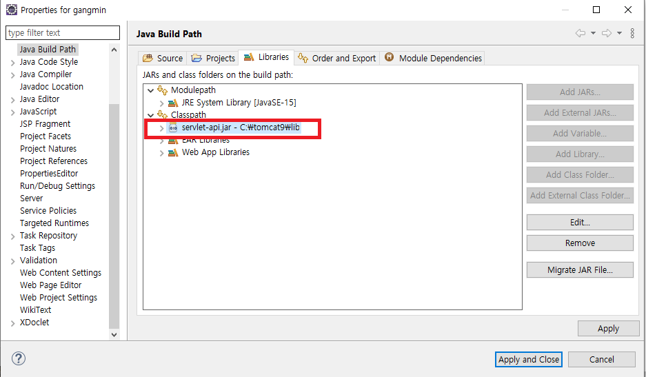

# gangmin
기본 환경설정 방법.
------------------
### 1. Git Repositories 복제하기

#### 1. 로컬 워크스페이스 생성

#### 2. Window > Show View > Other... 선택

#### 3. Git Repositories 선택

#### 4. Clone a Git repository 선택

#### 5. URI에 레포지토리 주소 입력

```
비밀번호 대신 토큰을 발급받아서 사용할 것
```
#### 6. Next >

#### 7. Finish

#### 8. import Project

#### 9. Projects from Git

#### 10. Existing local repository

#### 11. Select a Git Repository

#### 12. Import existing Eclipse projects

#### 13. Import Projects

#### 14. Import된 프로젝트를 Project Explorer 에서 확인

#### 15. Server 추가

#### 16. Tomcat v9.0 Server 선택

#### 17. Available에 있는 프로젝트를 Configured로 Add

#### 18. Build Path

#### 19. unbound로 표시되면 해당항목 Remove

#### 20. Add External JARs...

#### 21. Tomcat이 저장되있는 폴더의 lib

#### 22. servlet-api.jar 파일 선택

#### 23. Apply and Close


### 2. DataBase 설정
#### 1. DataBase 설치
	https://www.oracle.com/database/technologies/xe-prior-release-downloads.html
#### 2. DataBase 환경설정
	https://cmleo.tistory.com/19
### 2-1. sqldeveloper 설치
	https://www.oracle.com/database/sqldeveloper/technologies/download/
#### 3. Oracle 접속 후 TABEL 생성

```
CREATE TABLE MEMBER(
 mkey NUMBER(8) PRIMARY KEY,
 mid VARCHAR(45) UNIQUE NOT NULL,
 mpw VARCHAR(45) NOT NULL,
 mname VARCHAR(45) NOT NULL,
 mnickname VARCHAR(45) NOT NULL,
 mhp VARCHAR(45) NOT NULL,
 maddress VARCHAR(45),
 mmail VARCHAR(45),
 mtime date default sysdate,
 mbirthday VARCHAR(45),
 madmin NUMBER(1)
);
```
#### 4. SEQUENCE 생성
```
CREATE SEQUENCE tmp_seq START WITH 1 INCREMENT BY 1 MAXVALUE 100 CYCLE NOCACHE;
```
#### 5. Servers > Tomcat v9.0 > context.xml

#### 6. Source 탭 선택

#### 7. Source 탭 맨 밑쪽에 다음과 같은 코드 추가

```
    <Resource
        name="jdbc/oracle"
        auth="Container"
        type="javax.sql.DataSource"
        driverClassName="oracle.jdbc.driver.OracleDriver"
        url="jdbc:oracle:thin:@localhost:1521:XE"
        username="scott"
        password="tiger"
        maxActive="50"
        maxWait="-1"
     />
```
	username과 password는 환경설정때 자신이 사용했던 계정정보 입력

## DB QUERY문
### 1. Lecture Table
```
	CREATE TABLE LECTURE(
    lkey NUMBER(8) PRIMARY KEY,
    lid VARCHAR2(45) NOT NULL,
    lname VARCHAR2(45) NOT NULL,
    ltype VARCHAR2(45),
    lsubject VARCHAR2(45),
    lunit VARCHAR2(45),
    luser VARCHAR2(45),
    lcreate VARCHAR2(45),
    llevel VARCHAR2(45),
    ltime NUMBER(8),
    lprice NUMBER(10),
    lduration NUMBER(8),
    linfo VARCHAR2(4000),
    ltarget VARCHAR2(100),
    limage VARCHAR2(255),
    lstartdate DATE,
    lsumgrade NUMBER(10),
    lcountgrade NUMBER(8)
);
```
### 2. Lecture SEQUENCE
```
	CREATE SEQUENCE lec_seq START WITH 1 INCREMENT BY 1 MAXVALUE 1000 CYCLE NOCACHE;
```
### 3. Lecture Table 기본 정보
```
	INSERT INTO LECTURE(LKEY, LID, LNAME, LTYPE, LSUBJECT, LUNIT, LUSER, LCREATE, LLEVEL
,LTIME,LPRICE,LDURATION,LINFO,LTARGET,LIMAGE,LSTARTDATE,LSUMGRADE,LCOUNTGRADE)
 VALUES(LEC_SEQ.nextval, '한석원의 4의규칙', '한석원', '수능', '수학','수학I','고3, N수'
 ,'스튜디오','문제풀이',48,100000,1
 ,'4의 규칙은 22, 30번 문항을 제외한 4점 문항을 집요하게 훈련하여
\n
어떤 문제라도 망설임 없이 교과서가 제시한 방법으로 풀어내게 하는 강좌입니다.
\n\n
SEASON 1 : 22,30번을 제외한 모든 4점 문항 대비
\n
일관된 방법으로 4점 문항을 훈련할 수 있는 입문 N제 강좌
\n\n
01 절차탁마
\n
위기의 순간에서도 쌓아온 수학적 개념들이 자유롭게, 그리고 즉각적으로 결합될 수 있도록 풀이를 반복하여 갈고 닦습니다.
\n
따라서 이 강좌는 이미 개념학습이 끝난 수험생을 위한 강좌입니다.
\n\n
02 보편타당
\n
특정 문제에 적용되는 방법, 다양한 풀이 방법을 제시하지 않습니다.
\n
어떠한 문제라도 교과 개념 상 ‘나의 풀이 방법이 자명하다’의 수준이 될 때까지 익히고 또 익힙니다.
\n\n
03 이무일유
\n
이 강의는 4점 난이도에 맞춰져 있습니다.
\n
4점 문항을 통해 익히는 자유롭고 즉각적인 개념 결합과정, 이 연습이야말로 22, 30번을 대비하는 확실한 방법입니다.
\n\n
★수강 방법★
\n\n
1. 예습: 먼저 문제를 풀고 채점합니다.
\n
① 틀린 문제는 최소한 3번까지 다시 풉니다.
\n
(이 과정에서 출제 의도를 파악하고 문제를 해결하는 능력이 배양됩니다.)
\n
② 3번 이상의 시도에도 풀리지 않는 문제에 대해서만 해설지를 참고합니다.
\n
③ 해설을 이해해보고, 한번 더 풀어봅니다.
\n\n
2. 평가: 내가 선택한 풀이 방법에 대해 3가지 항목으로 평가합니다.
\n
① 다른 문제에 대해서도 적용한 방법인가?
\n
② 수능 현장에서도 자유자재로 사용할 수 있는 방법인가?
\n
③ 위기의 순간(가령 시간의 부족)에도 흔들림 없이 선택할 수 있는 방법인가?
\n\n
3. 비교: 3가지 평가항목에 해당하지 않는 경우 강의를 통해 한석원 선생님과 비교합니다.'
,'4점 난이도를 훈련하고 싶은 수험생을 위한 강좌입니다.'
,'hsw.jpg','2018-03-01',0,0)
```