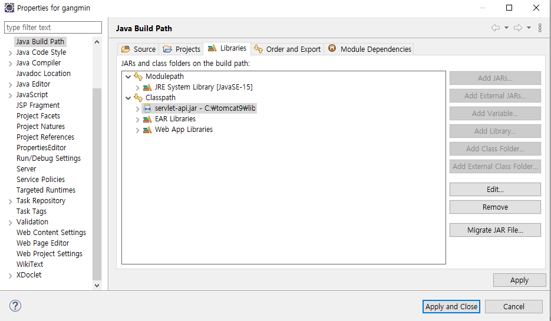

# gangmin
기본 환경설정 방법.
------------------
### 1. Git Repositories 복제하기

#### 1. 로컬 워크스페이스 생성

#### 2. Window > Show View > Other... 선택

#### 3. Git Repositories 선택

#### 4. Clone a Git repository 선택

#### 5. URI에 레포지토리 주소 입력

```
비밀번호 대신 토큰을 발급받아서 사용할 것
```
#### 6. Next >

#### 7. Finish

#### 8. import Project

#### 9. Projects from Git

#### 10. Existing local repository

#### 11. Select a Git Repository

#### 12. Import existing Eclipse projects

#### 13. Import Projects

#### 14. Import된 프로젝트를 Project Explorer 에서 확인

#### 15. Server 추가

#### 16. Tomcat v9.0 Server 선택

#### 17. Available에 있는 프로젝트를 Configured로 Add

#### 18. Build Path

#### 19. unbound로 표시되면 해당항목 Remove

#### 20. Add External JARs...

#### 21. Tomcat이 저장되있는 폴더의 lib

#### 22. servlet-api.jar 파일 선택

#### 23. Apply and Close



### 2. DataBase 설정
#### 1. DataBase 설치
	https://www.oracle.com/database/technologies/xe-prior-release-downloads.html
#### 2. DataBase 환경설정
	https://cmleo.tistory.com/19
### 2-1. sqldeveloper 설치
	https://www.oracle.com/database/sqldeveloper/technologies/download/
#### 3. Oracle 접속 후 TABEL 생성

```
CREATE TABLE MEMBER(
 mkey NUMBER(8) PRIMARY KEY,
 mid VARCHAR(45) UNIQUE NOT NULL,
 mpw VARCHAR(45) NOT NULL,
 mname VARCHAR(45) NOT NULL,
 mnickname VARCHAR(45) NOT NULL,
 mhp VARCHAR(45) NOT NULL,
 maddress VARCHAR(45),
 mmail VARCHAR(45),
 mtime date default sysdate,
 mbirthday VARCHAR(45),
 madmin NUMBER(1)
);
```
#### 4. SEQUENCE 생성
```
CREATE SEQUENCE tmp_seq START WITH 1 INCREMENT BY 1 MAXVALUE 100 CYCLE NOCACHE;
```
#### 5. Servers > Tomcat v9.0 > context.xml

#### 6. Source 탭 선택

#### 7. Source 탭 맨 밑쪽에 다음과 같은 코드 추가

```
    <Resource
        name="jdbc/oracle"
        auth="Container"
        type="javax.sql.DataSource"
        driverClassName="oracle.jdbc.driver.OracleDriver"
        url="jdbc:oracle:thin:@localhost:1521:XE"
        username="scott"
        password="tiger"
        maxActive="50"
        maxWait="-1"
     />
```
	username과 password는 환경설정때 자신이 사용했던 계정정보 입력

